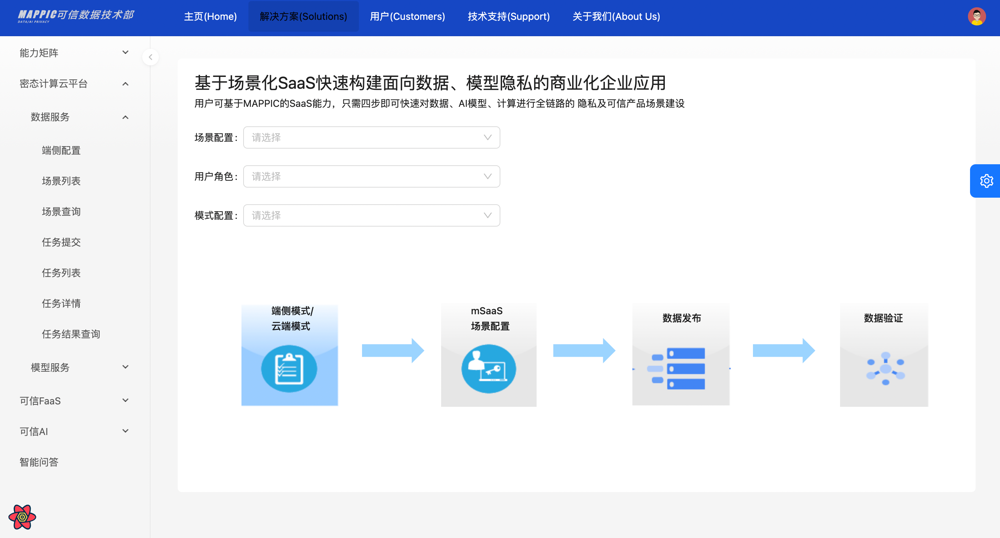

This article introduces detailed operations on how to quickly create and obtain MAPPIC services.

******


## <b>Introduction</b>
- MAPPIC is a confidential computing platform by Ant Group, targeting massive data and model privacy protection. MAPPIC offers a trial version on the Computing Nest, enabling you to rapidly deploy and experience MAPPIC services and operational monitoring without the need to purchase cloud servers on your own. This way, you can establish your own privacy protection applications.

- Core capabilities include: Privacy-Preserving AI/BI, TEE-based LLM Privacy-Preserving Inference and Fine-tuning; we also support a variety of data and AI open-source frameworks, such as Spark, ipex-llm, PyTorch, DeepSpeed, and more. Moreover, you can swiftly develop data sandboxing, trusted data spaces, and other confidential computing paradigms using MAPPIC.

- Currently, MAPPIC has discontinued its beta release. All users are invited to register for early access. Should you have any inquiries, please don't hesitate to join our community for discussion.

******

## <b>Instance Specifications (Recommended for TB-level data scale)</b>

#### <b>ACK version specifications</b>

1. 3 ECSs, and each ECS instance has a specification of 4 cores and 32G.
2. EPC: 48G, Plaintext: 48G
3. Operating System: Alibaba Cloud Linux 2.1903 LTS 64-bit (Hunting Beagle)
4. Instance Specification: [ecs.r7t.xlarge](https://www.alibabacloud.com/help/doc-detail/25378.htm#r7t)

For more commercial specifications and configuration references, please feel free to consult in the DingTalk group (69285014993).

**MySQL specifications**

| Version | Storage Capacity | CPU Specification | Maximum Connections | Time Zone   |
| --- | ------- | ------- | -------- |-----|
| 8.0 | 100g | 1c 2g | 2000 | 0   |

**Redis specifications**

| Version | CPU Specification | Remarks                       |
| ---- | ---- |-------------------------------|
| 5.0 | 1c 2g | Minimum standard, upgradeable |

******

## <b>Deployment Process</b>
#### <b>Preparation</b>

Before applying for a trial, you need to prepare an Alibaba Cloud account to access and create resources such as ECS, VPC, ROS, ACK, REDIS, RDS, etc.

- If you are using a primary account, you can create service instances directly.
- If you are creating service instances as a RAM user, and it's your first time using Alibaba Cloud's Computing Nest, you need to add the necessary permissions for the resources you intend to use to your RAM user's account before creating service instances.For more information, please refer to [Authorizing RAM Users](https://help.aliyun.com/zh/ram/user-guide/grant-permissions-to-the-ram-user)

#### <b>Step 1: Deployment Entry</b>
You can search through the MAPPIC keyword in Alibaba Cloud's computing nest, or click on the [Deployment Link](https://computenest.console.aliyun.com/service/instance/create/cn-hangzhou?spm=5176.24779694.0.0.36be4d22zpKKq3&type=user&ServiceId=service-ae7e12bcabc840f1bf14&isTrial=true) to quickly experience it.

#### <b>Step 2: Apply for Trial</b>
Before using, please complete the application process following the provided instructions. Once your application has been approved, you will be able to proceed with creating your service.


#### <b>Step 3: Create Service</b>
1. Access the service activation configuration interface. Following our recommended [machine specifications], sequentially fill in the **service instance name, select the region, payment type, database username and password, cluster configuration, as well as network settings**. Finally, **click on Confirm Order**.

    

2. On the **order confirmation page**, confirm permissions, basic configuration, and billing information. After confirming everything is correct, click **Create Now**.

    > **Explanation**: If there is a lack of permissions, it is recommended to apply for the missing permissions before creating the service, otherwise it may cause resource creation failure.

    

3. After successful submission, you can click the **go to list view** button to go to the service instance page to view the creation information of the service instance.
The process of creating a service instance takes approximately 20 minutes, please be patient.

    
******

## <b>Manage Resources</b>

1. After the service instance is created, you can click on the service instance name on the service details page or service instance page to enter the service instance details page.
    
    
    

2. On the service instance details page, click on the resource tab to view instance information such as MySQL, Redis, and ECS, and perform maintenance.
    
    
******

## <b>Quick Experience</b>
1. Verify Service Deployment Results

    After entering the [Compute Nest service](https://computenest.console.aliyun.com/welcome/cn-hangzhou?spm=a2c4g.11186623.0.0.4aa15a05BUElCU), select **My Services** in the left navigation bar, click on the service name to enter the service details page, and then click on the **Service Instance** tab to view all current instance information.
    

2. View External Service IP

    Click on the service instance name or ID to enter the service instance details page and view the access IP address.
   
      

3. Default Definitions (Not Modifiable in Trial Version)

    | Definition | CPU Description | 
    |------------| ---- |
    | tenantId   | tenant Name: **mappic_confidential_cloud_computing**|

4. Configure User's OSS Address (Mandatory)

    Update the OSS address to the user's own OSS.

    a. Modify the following properties in the **spark_config** attribute.

    | Field | Field Meaning | 
    |------------| ---- |
    | ossEndpoint | User's Own OSS Address |
    | ossAccessKeyId | User's OSS AK |
    | ossAccessKeySecret | User's OSS SK |

    b. Modify the following fields in the **oss_config** attribute.

    | Field | Field Meaning | 
    |------------| ---- |
    | mainDevOssEp | User's Own OSS Address |
    | mainDevOssBucketName | Bucket Name for Upload Execution Plans |
    | mainDevOssFilePath | Path for Upload Execution Plans |
    | mainDevOssAccessKeyId | OSS AK |
    | mainDevOssAccessKeySecret | OSS SK |
    | mappicOssBucketName | Bucket Name for Log Uploads |
    | mainDevOssLogFilePath | Storage Path for Task Execution Logs |
    | mappicOssAccessKeyId | OSS AK |
    | mappicOssAccessKeySecret | OSS SK |

    Update tenant OSS configuration through the following interface


```java
    curl -X POST -d  '{"tenantId": "mappic_confidential_cloud_computing","ossEndpoint": "xxxxxxxx","ossAccessKeyId": "xxxxxxx","ossAccessKeySecret": "xxxxxxx","mainDevOssEp": "xxxxxxx","mainDevOssBucketName": "xxxxxxx","mainDevOssFilePath": "xxxxxxx","mainDevOssAccessKeyId": "xxxxxxx","mainDevOssAccessKeySecret": "xxxxxxx","mappicOssBucketName": "xxxxxxx","mainDevOssLogFilePath": "xxxxxxx","mappicOssAccessKeyId": "xxxxxxx","mappicOssAccessKeySecret": "xxxxxxx"}' \
            --header 'Content-Type: application/json' \
            --header 'Accept: */*' \
            --header 'Connection: keep-alive' \
            'http://ip:8889/mappic/tenant/oss/update'
```


5. Interface Integration

    The following tenant Id parameters are all tenant names mentioned above: mappic_confidental_cloud_computing.
    
       **a. Initialize Trusted Application (Mandatory Execution)**

```java
    curl --location 'ip:8889/api/antchain/installApp' \
    --header 'Content-Type: application/json' \
    --data '{
    "tappId":"mappic-vic",
    "tappVersion":1
    }'
        
    // return result
    {"filesName":null,"executeId":null,"executeMessage":"执行成功","failedReason":null,"successMessage":"app安装成功","object":null}
```

&nbsp;&nbsp;&nbsp;&nbsp;**b. Create Metadata**

&nbsp;&nbsp;&nbsp;&nbsp;**Create Output Table**

```java
    curl --location --request POST 'ip:8889/mappic/datameta' \
    --header 'Content-Type: application/json' \
    --header 'Accept: */*' \
    --header 'Connection: keep-alive' \
    --data '{
        "tenantId": "mappic_confidential_cloud_computing",
        "tableMetas": [
            {
                "tableName": "fred_test_table22",
                "instId": "bfaa0186c7914119bf23ed0f30b4d4b6",
                "encryptKey": null,
                "storageInfo": "oss://mappic-dev/endToEnd/fred_test_table22",
                "isEncrypted": false,
                "partitionPattern": null,
                "isTemp": false,
                "columnInfo": [{"columnName":"event_id","isEncrypted":false},{"columnName":"event_link_id","isEncrypted":false},{"columnName":"merchant_id","isEncrypted":false},{"columnName":"merchant_name","isEncrypted":false},{"columnName":"user_id","isEncrypted":false},{"columnName":"gmt_occur","isEncrypted":false},{"columnName":"acq_site_id","isEncrypted":false},{"columnName":"acq_site_name","isEncrypted":false},{"columnName":"acq_site_event_amount","isEncrypted":false},{"columnName":"acq_site_event_currency","isEncrypted":false},{"columnName":"pay_site_id","isEncrypted":false},{"columnName":"pay_site_name","isEncrypted":false},{"columnName":"pay_site_user_id","isEncrypted":false},{"columnName":"pay_site_event_amount","isEncrypted":false},{"columnName":"pay_site_event_currency","isEncrypted":false},{"columnName":"gn_payment_id","isEncrypted":false},{"columnName":"gn_event_amount","isEncrypted":false},{"columnName":"gn_site_user_id","isEncrypted":false},{"columnName":"payment_scenario","isEncrypted":false},{"columnName":"is_in_store_payment","isEncrypted":false},{"columnName":"campaign_id","isEncrypted":false},{"columnName":"campaign_type","isEncrypted":false},{"columnName":"campaign_name","isEncrypted":false},{"columnName":"campaign_status","isEncrypted":false},{"columnName":"begin_time","isEncrypted":false},{"columnName":"end_time","isEncrypted":false},{"columnName":"promo_amount","isEncrypted":false},{"columnName":"promo_currency","isEncrypted":false},{"columnName":"gn_promo_amount","isEncrypted":false},{"columnName":"promo_type","isEncrypted":false},{"columnName":"promo_source","isEncrypted":false},{"columnName":"promo_result","isEncrypted":false},{"columnName":"promo_stage","isEncrypted":false},{"columnName":"coupon_id","isEncrypted":false},{"columnName":"order_title","isEncrypted":false},{"columnName":"result_message","isEncrypted":false},{"columnName":"error_message","isEncrypted":false},{"columnName":"event_properties","isEncrypted":false},{"columnName":"refund_status","isEncrypted":false},{"columnName":"acq_payment_amt","isEncrypted":false},{"columnName":"pay_result","isEncrypted":false},{"columnName":"pay_result_message","isEncrypted":false},{"columnName":"refund_amt","isEncrypted":false},{"columnName":"order_succ","isEncrypted":false},{"columnName":"decision_rule_id","isEncrypted":false},{"columnName":"psp_decision","isEncrypted":false},{"columnName":"psp_riskinfo","isEncrypted":false},{"columnName":"play_id","isEncrypted":false},{"columnName":"apt_gn_site_user_id","isEncrypted":false},{"columnName":"dt","isEncrypted":false}]
            }
        ]
    }'
```

&nbsp;&nbsp;&nbsp;&nbsp;**Create Input Table**

```java
    curl --location --request POST 'http://ip:8889/mappic/datameta' \
    --header 'Content-Type: application/json' \
    --header 'Accept: */*' \
    --header 'Connection: keep-alive' \
    --data-raw '{
        "tenantId": "mappic_confidential_cloud_computing",
        "tableMetas": [
            {
                "tableName": "adm_ctu_app_gn_multi_data_collect_di", 
                "instId": "bfaa0186c7914119bf23ed0f30b4d4b6",
                "encryptKey": null, 
                "storageInfo": "xxxxx",
                "isEncrypted": false,
                "partitionPattern": null,
                "isTemp": false,
                "columnInfo": [
                        {
                            "columnName":"event_id",
                            "isEncrypted":false
                        }
                        ]
            }
        ]
    }'
```
&nbsp;&nbsp;&nbsp;&nbsp;**c. Submit a Task, Obtain the Task Instance**

```java
    curl --location 'http://ip:8889/mappic/task/template' \
    --header 'Content-Type: application/json' \
    --header 'Accept: */*' \
    --header 'Connection: keep-alive' \
    --data '{
        "tenantId":"mappic_confidential_cloud_computing",
        "sql":"select * from adm_ctu_app_gn_multi_data_collect_di limit 1000",
        "config":{},
        "inputTables":["bfaa0186c7914119bf23ed0f30b4d4b6.adm_ctu_app_gn_multi_data_collect_di"],// 机构id·表名的结构
        "outputTable":"bfaa0186c7914119bf23ed0f30b4d4b6.fred_test_table22",
        "priorityLevel":1,
        "baseConfig":{
            "name":"xxx",
            "instId":"bfaa0186c7914119bf23ed0f30b4d4b6",
            "jobId":"xxxx",
            "timestamp":"2023-11-14 11:28:30",
            "env":"DEV"
        }
    }'
```

6. Checking Execution Status

    - **Method 1: Check via an API**

        The 'taskInstanceId' required for the task log should be the information returned when the task was created.

```java
    curl --location 'localhost:8889/mappic/task/log?taskInstanceId=instanceid&tenantId=mappic_confidential_cloud_computing&logWindowSecs=1'

    // Query logs and return results
    { 
      "errorCode":null,
      "errorMessage":null,
      "status":null,
      "data":{
        "logPath":"xxxxxx"
      },
      "success":true
    }
```

```java
    curl --location 'localhost:8889/mappic/task/detail?taskInstanceId=instanceid&tenantId=mappic_confidential_cloud_computing&env=DEV'

    // Query task details and return results
    {
      "errorCode":null,
      "errorMessage":null,
      "status":null,
      "data":{
        "taskInstanceId":"your instance id",
        "ossPath":"xxxx"
      },
      "success":true
    }
```
```java
    curl --location 'localhost:8889/mappic/task/status/list' \
    --header 'Content-Type: application/json' \
    --data '{
        "tenantId": "mappic_confidential_cloud_computing",
        "taskInstanceIds": ["instanceId"]
    }'

    // Query task status and return results
    {
      "errorCode":null,
      "errorMessage":null,
      "status":null,
      "data":{
        "statusDetail":[
          {
            "taskInstanceId":"xxxxxx",
            "status":"RUNNING",
            "startTime":"1715602501000",
            "currentTime":"1715603076530"
          }
        ]
      },
      "success":true
    }
```

- **Method 2：Check the execution status on the console**

   i. Check task container label ID based on task instance ID, by job ID.

```sql
   SELECT a.id, a.`sql`,a.`status`,a.`request_id`,b.`status`,a.`input_tables`,a.`output_table`,
          b.`mytf_request_id`,a.`create_time`,b.`gmt_finish`,c.`job_id`,a.`spark_args` 
   FROM `task_table` AS a LEFT JOIN `async_tapp_request` AS b ON a.`request_id`= b.`request_id` 
   LEFT JOIN `request_task_relation_table` AS c
   ON b.`mytf_request_id`= c.`task_id` 
   WHERE a.`sql` NOT LIKE "LOAD%" 
   AND a.`instance_id` = "instanceid"
   ORDER BY a.`id` DESC 
   LIMIT 200;
```

ii. Check the Ack cluster -> Click on workloads -> Container group -> Switch the namespace to default -> Query by tag:

**Query**: mss_job_id= to get the job ID (remove the last character).


#### <b>Web Experience (for non commercial versions only)</b>
1. Login page

    

2. Login Home

    

3. Dense data analysis scenario

    data provider

    

    data apply

    

    

**More platform experience links to join the group (69285014993), contact administrators @linke and @fanxuedong.**

******

# contact us
- **Contact email**：antchainmappic@service.alipay.com

- **Quick problem troubleshooting**：You can contact us through the technical exchange group. Please refer to the QR code below:

**MAPPIC DingTalk exchange group**：


**MAPPIC WeChat exchange group**：


